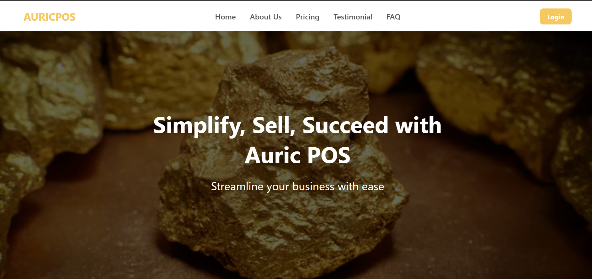
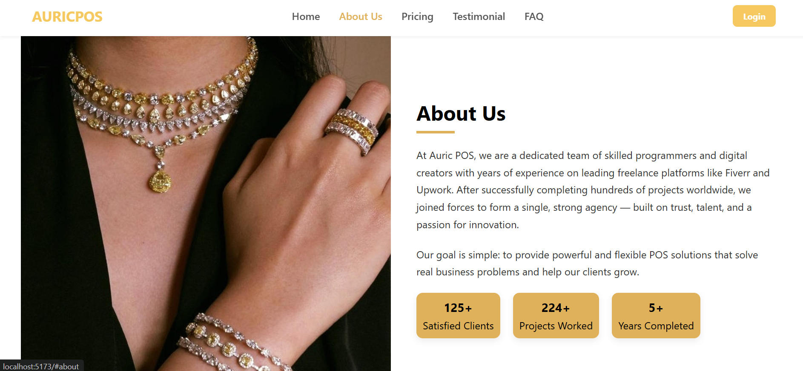
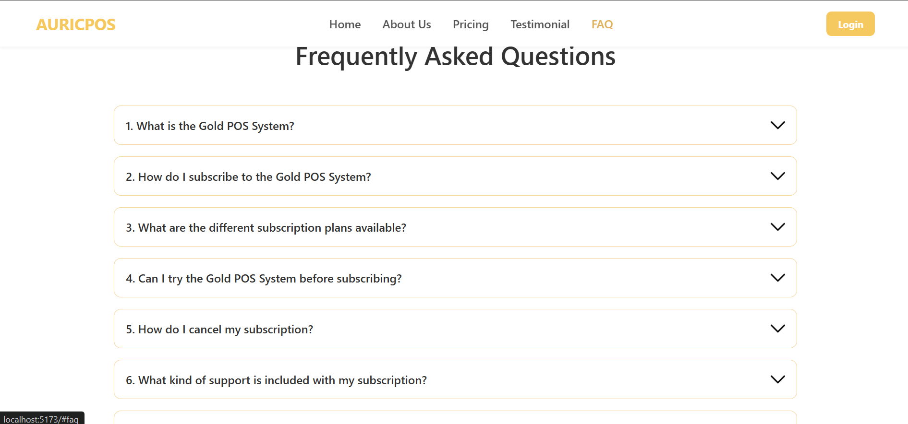
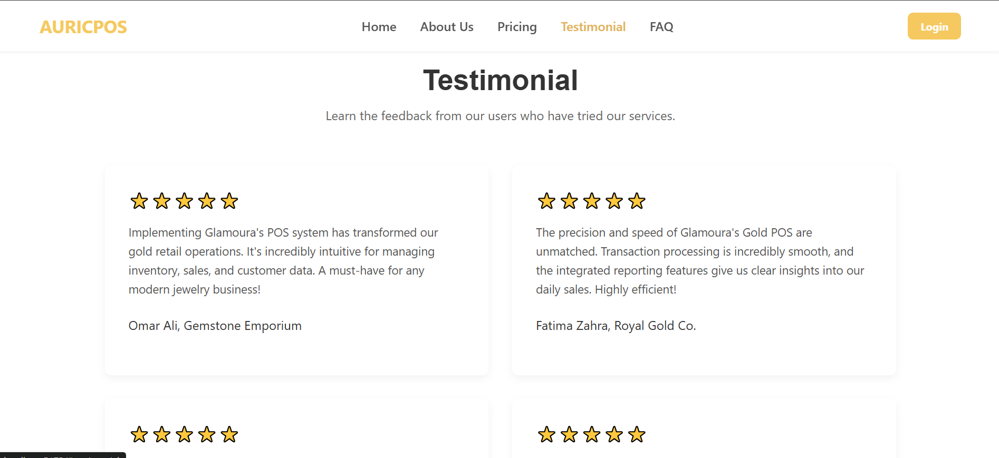
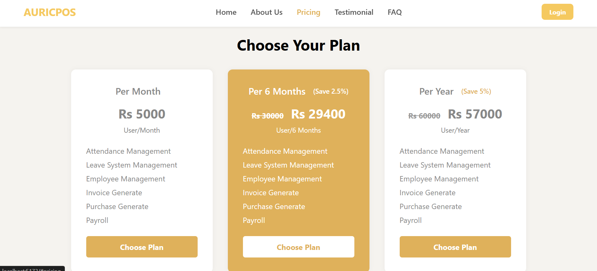
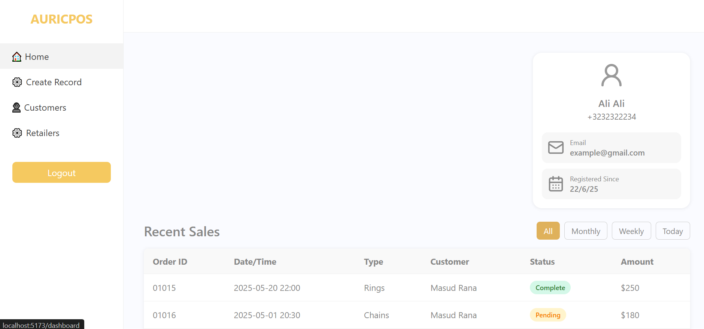
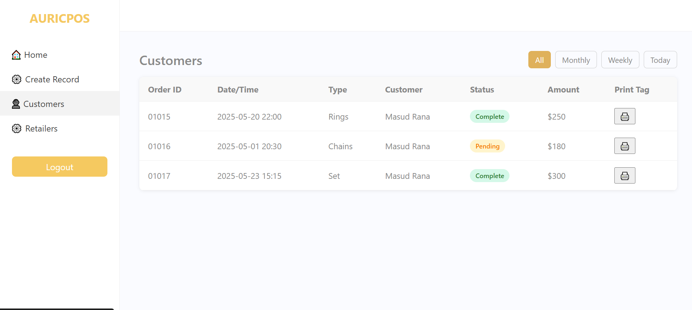
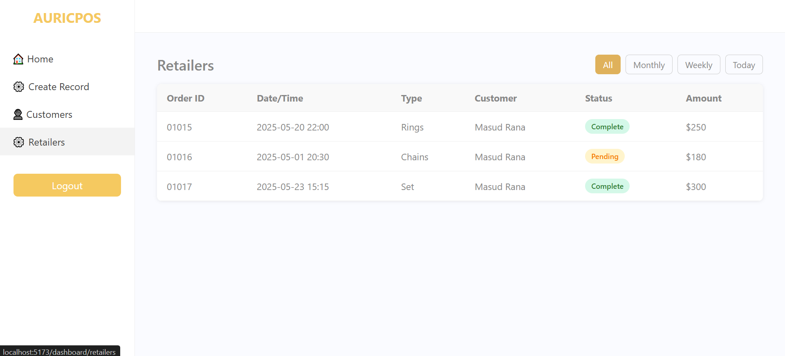
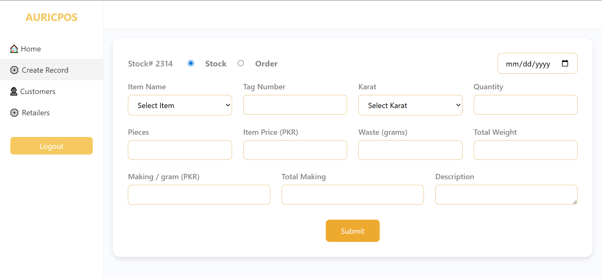

# AuricPOS – GoldPOS

AuricPOS is a Point of Sale (POS) system designed for gold/jewelry businesses, enabling smooth inventory tracking, billing, and customer management.


---

## 📖 **About The Project**

The main goal of **AuricPOS – GoldPOS** is to provide gold and jewelry businesses with a streamlined POS system that:

- Manages gold inventory and transactions effectively.
- Simplifies billing and customer records.
- Provides a responsive and user-friendly interface for retail operations.
- Uses modern technologies for scalability and performance.

  [](https://github.com/emanfaisal333/auric-pos)

---

## 🛠️ **Technologies Used**

-   
-   
-   
-   
-   
-   

---

## 🚀 **How to Run the Project**

### Prerequisites

- Node.js and npm
- MongoDB installed or MongoDB Atlas account

### **1. Clone the Repository**

```bash
git clone https://github.com/emanfaisal333/AuricPOS-GoldPOS.git
```
2. Navigate to the Project Directory
```bash
cd auric-pos
```
3. Set up the Backend
```bash

cd backend
npm install

```
This starts the backend server.

4. Set up the Frontend
Open a new terminal and run:

```bash
cd goldPOS
npm install
```
   This runs the frontend on your local development server (usually http://localhost:3000).

5. Configure the Database
   Make sure MongoDB is installed and running locally, or use a cloud MongoDB service (like MongoDB Atlas).

6. Set your database connection string in a .env file inside the backend folder:

```bash
MONGO_URI=your-mongodb-connection-string
PORT=5000
JWT_SECRET=your_jwt_secret
```

7. Create a `.env` file in `goldPOS/` with your environment variables:

```
VITE_API_BASE_URL=base_url
```

8. Start the backend server

```bash
cd ../backend
nodemon server.js
```

9. Start the frontend app

```bash
cd ../goldPOS
npm run dev
```

---

## 🔐 Authentication

- Login with registered credentials
- JWT-based authentication and route protection
- Admin/staff role separation

---

## 📌 Deployment

Auric POS is live at:  
👉 [**http://www.auricpos.com/**](http://www.auricpos.com/)

---


## 📸 System Screenshots

<details>
<summary>🏠 Website Pages</summary>

### About Page


### About Us Section


### FAQs


### Testimonials


### Pricing Page


</details>

<details>
<summary>📊 POS</summary>

### Login Page


### Admin Dashboard


### Customers View


### Retailers View


### Order Form


</details>
